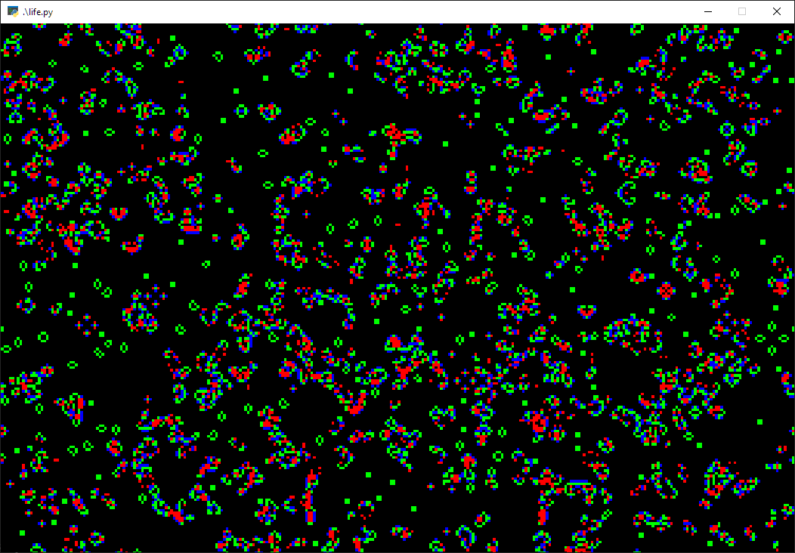

A simple example of Conway's Game Of Life, using Pyglet for visualization and Cython for speed.

This version uses Cython's "pure Python" syntax, so it can be run both with and without Cython compilation. This demonstrates clearly the difference in speed between regular Python and Cython.

Install requirements before doing anything else. A venv is recommended. Use `python compile.py` to build the extension modules.

Run `life.py` from the root directory to execute the demo.

The numbers that pop up in the console during runtime are:
* the average time taken by the program to compute a new generation of the playing field
* time to render the results to the buffer
* time to draw 

Th `src\life.py` file has some alternate rules for Life that can be uncommented and used in place of the existing rules.

You can also edit the colors used to render the playing field by altering the values for `colors` in `src\conway.py`.

License: MIT